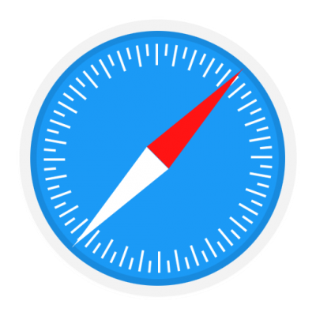

# [Zede Agency ](https://zede.tech/) 

## What is Zede Agency?

Zede agency is a web development federation that uses state of the art technologies.

```
material-dashboard-react
.
├── pages
│  ├── about
│  ├── api
│      ├── subscribe
|  ├── contact
|  ├── portfolio
|  ├── about
├── public
│   ├── images
│       ├── readme
│   ├── fonts
│   ├── animations
|── src
│  ├── components
│      ├── AboutZede
│      ├── Footer
│      ├── LaningPage
│           ├── FeaturedPortfolio
│           ├── Hero
│           ├── LetsTalk
│           ├── Services
│               ├── Header
│               ├── Section
│           ├── WorkFlow
│               ├── Header
│               ├── Section
│      ├── LetsTalk
│      ├── Navigation
│           ├── NavLink
│      ├── PageHeader
│      ├── Portfolios
│           ├── Detail
│           ├── Summary
│      ├── Team
│  ├── utils
│      ├── hooks
│      ├── style

```

## Browser Support

At present, This site officially aim to support the last two versions of the following browsers:

   

## Resources

- Issues: [Github Issues Page](https://github.com/abelofficial/Zede-agency/issues)
- Progress board: [Git-flow board](https://github.com/abelofficial/Zede-agency/projects/1)

## Reporting Issues

GitHub Issues is used as the official bug tracker for the Zede agency.

## Licensing

- Copyright 2020 Nebelbeal (https://nebelbeal.tech)
- Licensed under MIT (https://github.com/abelofficial/nebelbeal-admin/blob/development/LICENSE.md)
